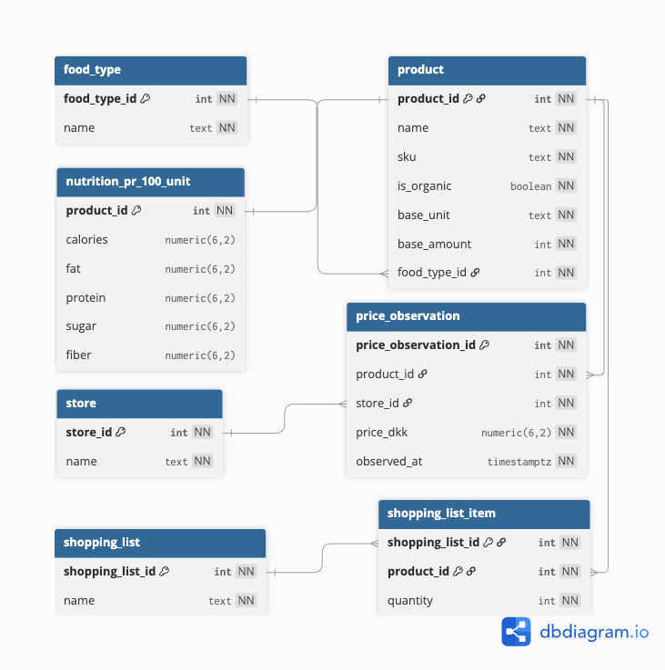

# CS50 SQL – Grocery Price & Nutrition Database

**Author:** Benjamin Lykke Colding  
**Course:** Harvard CS50 – Introduction to Databases with SQL  

A relational database designed to compare grocery prices and nutritional value across stores.

## Overview

The database models **products, stores, prices, nutritional information, and shopping lists**.  
It supports queries such as:
- Cheapest store for a given shopping list
- Price normalized per 100g for fair comparison
- Nutritional value (e.g. protein) per DKK
- Comparisons across stores and time

The database is populated with **synthetic data**. Data collection and scraping are outside the project scope.

## Data Model

The schema separates products, stores, and time-stamped price observations to allow historical comparison and normalization. Shopping lists enable basket-level price calculations.



## Key Features

- Time-based price observations
- Normalized price comparisons (DKK per 100g)
- Nutrition-per-price analysis
- Shopping-list cost comparison across stores
- Optimized with views and indexes


## Limitations

- Products are assumed comparable across stores (brand and size differences ignored)
- Discounts, loyalty pricing, and regional variation not modeled
- Latest observed prices may not reflect availability at purchase time

## Run Locally (Docker)

The database can be run locally using Docker and initialized from a clean state.

```bash
cp .env.example .env
docker compose up -d
psql -h 127.0.0.1 -p 5433 -U postgres -d groceries -f setup.sql
